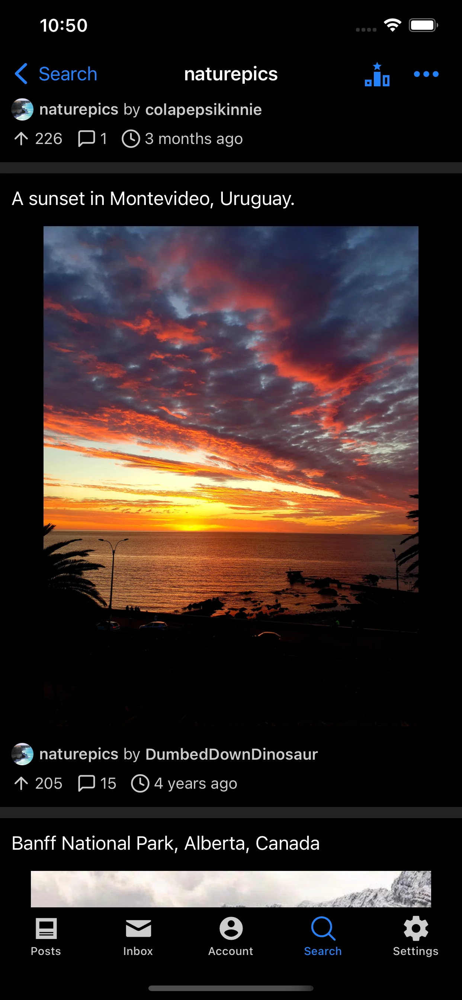
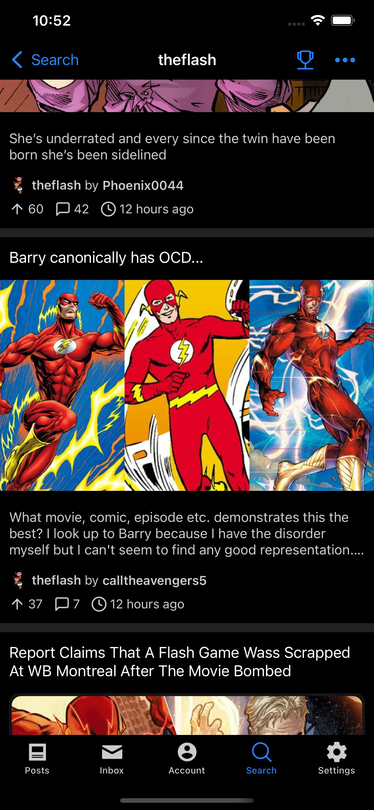
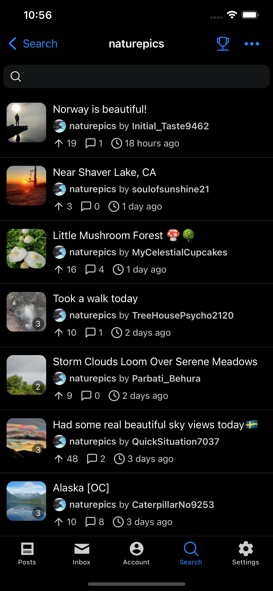
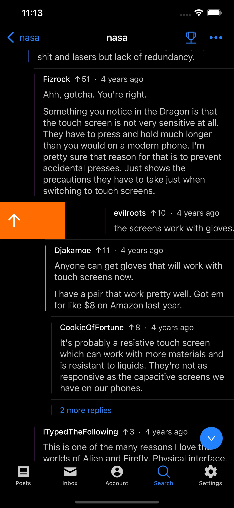

Hydra is a native client for browsing Reddit and the ultimate experience on iOS. It is fast, fluid, and designed to make browsing Reddit natural and intuitive.

This build is distributed by an independent third party not related to the upstream Hydra project.

Crafted with a native iOS design, Hydra feels right at home on your iPhone and iPad. It loads fast, responds instantly, and makes reading and participating in discussions effortless.

### Features
- Fast loading for browsing feeds and media
- Multireddit support for organizing your favorite topics
- Favorite subreddits to keep your communities accessible
- Native iOS design and gesture-driven navigation
- Integrated image and video viewer with inline playback
- Split view and multi-column support on iPad
- Quick swipe gestures to upvote, downvote, reply, and collapse comments
- Markdown formatting for posts and comments
- System share integration to export links, media, and comments as images
- Comprehensive search across posts, subreddits, and user profiles
- Multiple color themes including Midnight, Discord, Spotify, and Light modes
- Content filters to blur spoilers and NSFW material

| | |
|---|---|
|  |  |
|  |  |

Upstream Source Code Repository: https://github.com/dmilin1/hydra
